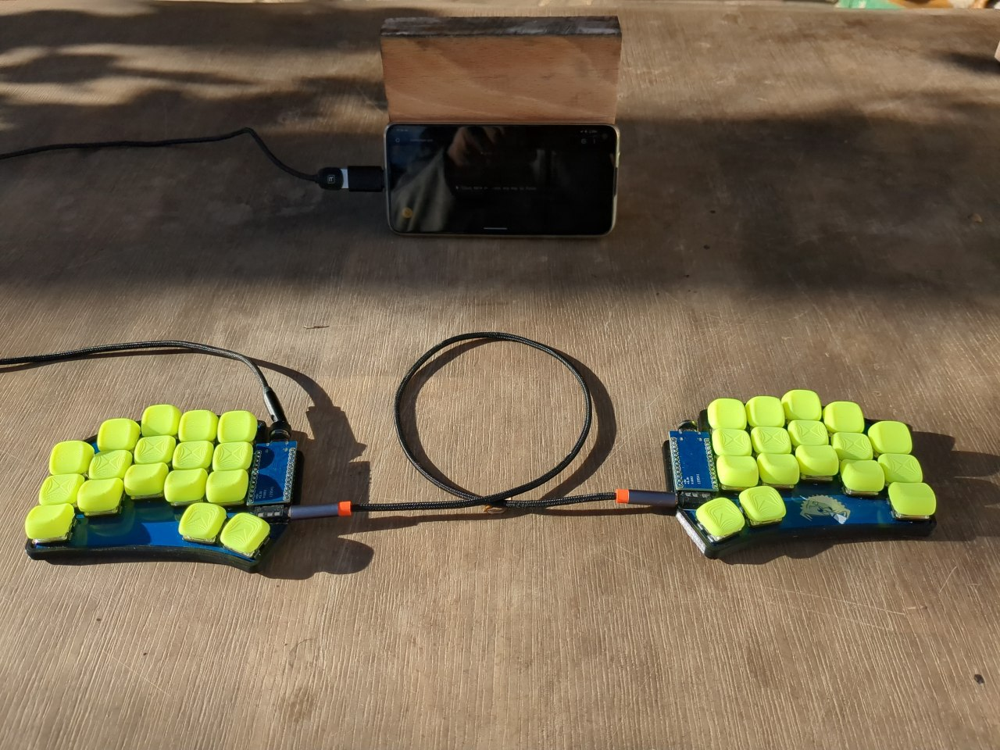
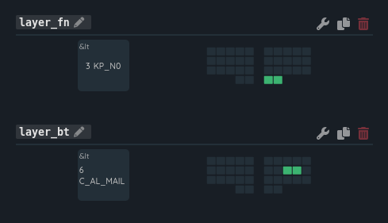
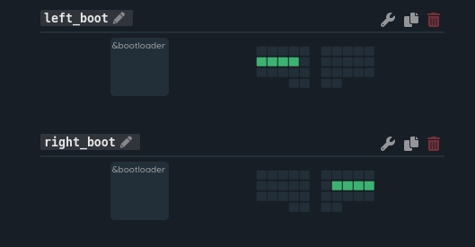

34 Key Layout Using ZMK For Ferris Sweep Split Keyboard

This is a 34-key layout I created and use on my Ferris Sweep keyboard. Currently the keyboard has 7 layers:
Master half is left part of keyboard, slave - right.

## Layouts

**0 - main** 

**1 - num** 

**2 - symbol** 

**3 - fn** 

**4 - nav** 

**5 - mouse** 

**6 - bluetooth** 

## Combos

**1 - main** 

**2 - symbol** 

**3 - layer** 

**4 - bootloader** 

## How to configure and update firmware

1. Grab my working repository (https://github.com/dimadzhmil/zmk-config-sweep);
2. Create an account on github.com and fork this repository.
3. Connect your repository to the online ZMK configurator (https://nickcoutsos.github.io/keymap-editor/);
4. Change and save in the online configurator;
5. After 2-3 minutes the firmware archive will appear in the ZMK configurator (firmware.zip) - download;
6. Put the microcontroller in the firmware mode (press the uppermost right key for the left half, and press the uppermost left key for the right half), a new partition should appear - mount;
7. Rewrite the appropriate firmware for the half;
8. After 10 seconds~ the microcontroller will flash itself and reboot.
9. Enjoy.
